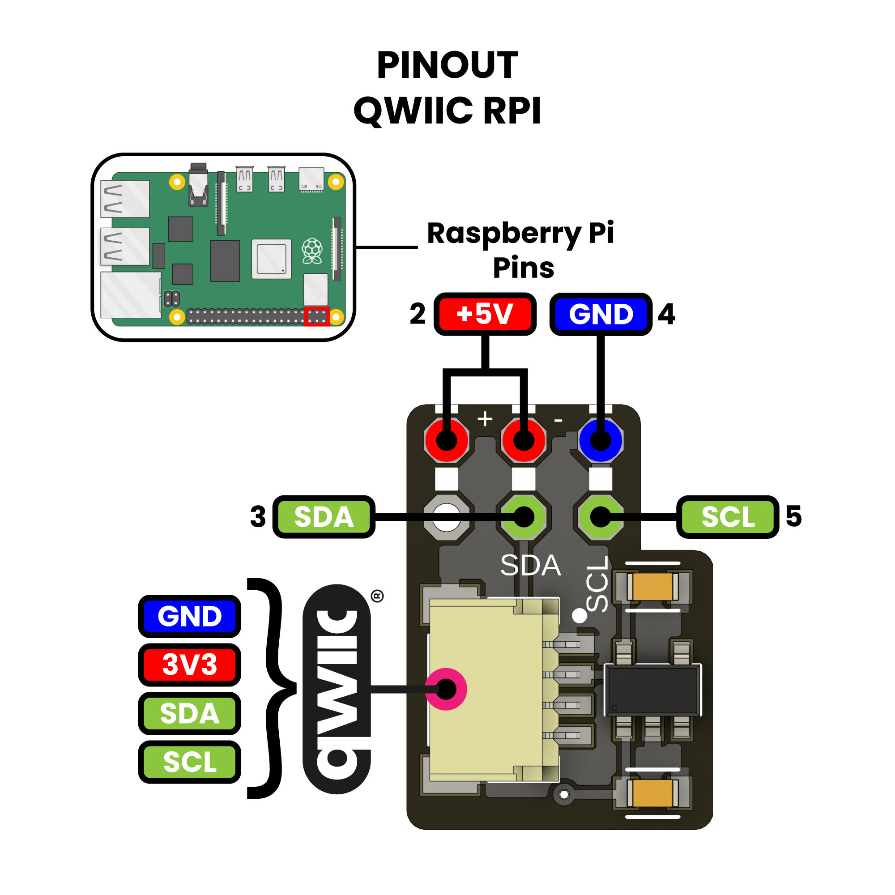

# UNIT QWIIC RPI Module 

## Description

This module is a Qwiic interface for the Raspberry Pi (RPi) single board computer. It is designed to be used with any of the Qwiic sensors or devices that SparkFun or Unit ELectronics produces. Simply plug a Qwiic cable into the Qwiic RPi and plug the other end into the sensor you want to use. This way you can stack multiple sensors on the same bus and only use one I2C port on the RPi (which is great for the RPi Zero). The Qwiic RPi also has a built-in level shifter so you can use 3.3V.

    

